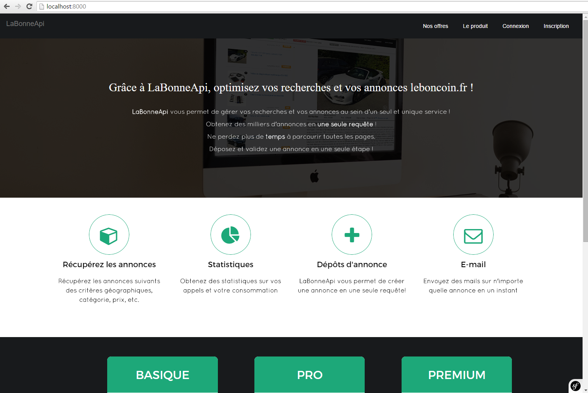
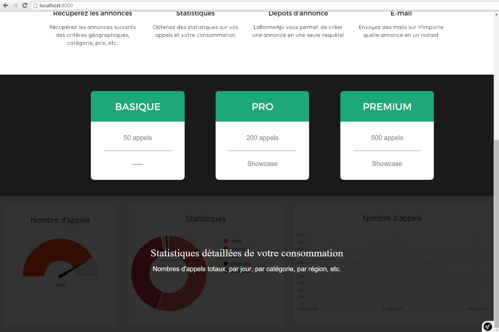
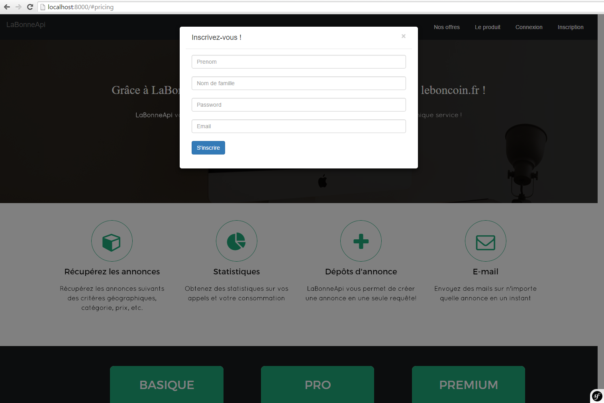
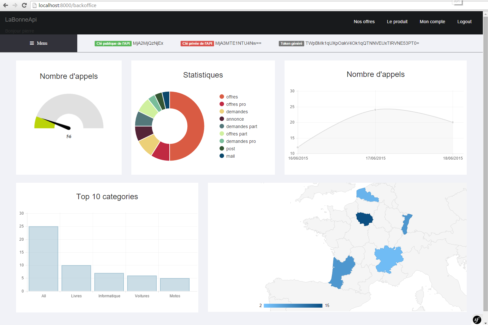
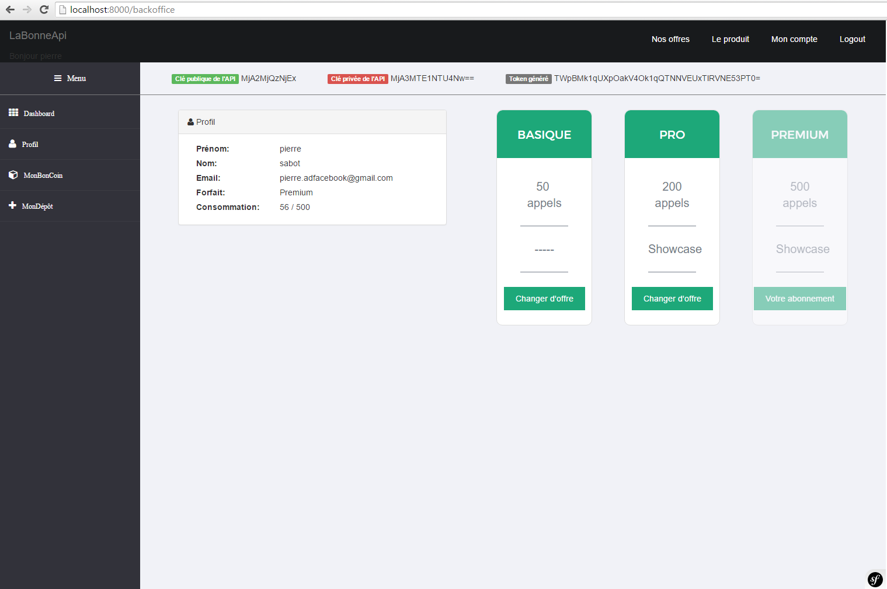
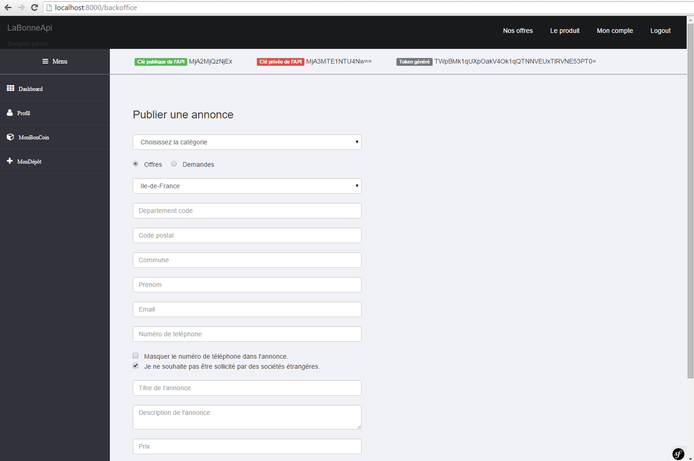

# ApiProject
> Restful API / PHP / Symfony2 / Group of 2
* Conception, Design, Programming
* PHP5, Symfony2, PostgreSql, Bootstrap, Google Charts
* Group of 2

Aim was to make a Restful API for a major French categorized Ads Website (http://www.leboncoin.fr/).
Our platform allowed user to check and post Ads directly from there, very simplified and with all functionalities possible.
The user could also apply to Ads and contact the sellers directly from our platform and save them.
Finally he could check all his statistics through a personalized Dashboard.

### Screenshots

